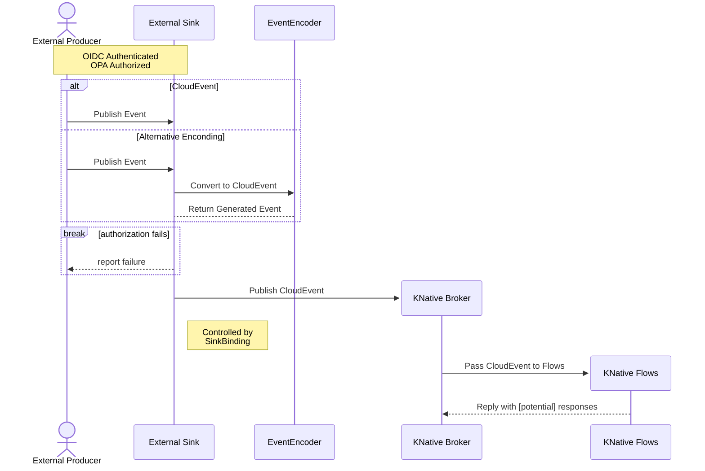
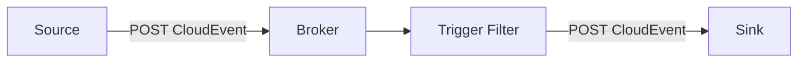

# Architecture

Subcomponent architecture and interfaces.

!!! warning
    Work in progress... :construction_worker:

The notification component is built around the [KNative-Eventing](https://knative.dev/docs/eventing/) and provides the core events for the automation component.


The notification component of the building block is composed out of two components:

- Producers
- Consumers

Overall the common interaction sequence for EOEPCA+ is depicted in the following sequence diagram:



## Components

`Sinks` are the core concept of the notification component. They are Kubernetes resources that act as destinations (basically consumers) for events in EOEPCA. They enable decoupled communication betweent event producers and consumers by providing an abstraction layer for event routing. `Sinks` are addressable resources and they expose an URL endpoint for receiving events (encoded as `CloudEvents`) via HTTP POST. `Sinks` are the foundation of EOEPCAs notification system as they enable flexible integration between event producers and consumers.



### Producers
Producers are components responsible for generating and emitting events. The events are further captured by `Sinks` (usually Brokers or Channels) and further routed by the notification system. 

Events are normally generated when a state changes (or an action is triggered) in a component. As previously mentioned this events should be encoded as CloudEvent compliant payload. 

Producers are completly decoupled form consumers and can produce events regardless if there are consumers present.

Any component can act as a producer as long as it cand issue a HTTP POST to a specific endpoint (usually a broker endpoint, or sink).

The location of the endpoint/sink where events should be directed can be handles using multiple approaches:

- **Hard Coded** : `Sink` address can be hardcoded in the application (eg. http://eoepca-broker.default.svc.cluster.local. Destination sink could be made configurable in the Kubernetes Deployment/StatefulSet based on a Helm value.
- **Dynamically Injected**:  KNative-Eventing facilitates the automatic injection of the destination `Sink` using a `SinkBinding`. Basically KNative injects two environment valiables, as follows: `K_SINK` representing the URL of the resolved destination sink and `K_CE_OVERRIDES` containing a JSON object that specifies overrides to the outbound event.

The recommended approach in EOEPCA+ is a mix between the two approaches:

- Applications should be aware that if the `K_SINK` environment variable is present then it is expected to `POST` CloudEvents to that specific URL
- Applications should handle with care the `K_CE_OVERRIDES` as it might also overide the `type` attribute and respect that specific overide.

### Consumers

In EOEPCA+ an event consumer cand be represented by any component which can receive a HTTP Post. Basically any HTTP enabled application can act as a `Sink` and receive events.

Applications/Sinks which receive and return events are called *Callable Sinks*. If they are triggered by a Broker with an event then the returned events is ingested back by the Broker entering again the event processing/routing system.

## Type Hierarchy

The proposed event type naming scheme in EOEPCA+ adheres tot the core naming structure in KNative. Particularly we use recommend the reverse domain notation to avoid collisions.

This approach results in a hierarchical format like:

```
<domain>.<component>.<event-category>.<action>
```

Example: `org.eoepca.processing.application-package.published`

Events generated by internal EOEPCA+ components should always issue events prefixed by the above schema (prefixed by `org.eoepca` and adhering as much as possible to the `buidling-block.category.action` convention). 