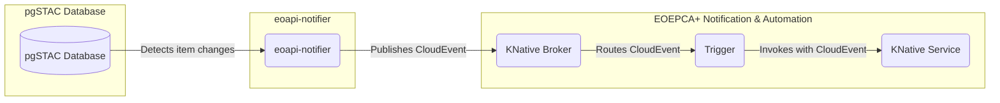

# How-Tos

# Example 1: Consumer of eoapi-notifier

This is a simple example of how to use the notification component to trigger a Knative function based on an event produced by
[eoapi-notifier](https://github.com/developmentseed/eoapi-notifier). 

This example showcases the end-to-end setup of a pipeline that:

1. Detects item-level changes in a [pgSTAC](https://github.com/stac-utils/pgstac) database using [eoapi-notifier](https://github.com/developmentseed/eoapi-notifier).
2. Publishes those changes as [CloudEvents](https://cloudevents.io/) into the EOEPCA+ Notification & Automation broker via a **SinkBinding**.
3. Routes the events through a **Knative Trigger** to a **Knative Service** (function) that logs the full event payload to stdout.

The following diagram depicts the overall architecture of the example:


---
## Prerequisites
We presume that the Knative Operator and the EOEPCA+ Notification & Automation building block are already installed in the cluster. 
Similarly, we also presume that the pgSTAC database is already set up and configured to work with eoapi-notifier. Specifically:
* EOEPCA+ Notification & Automation installed (see Quick Start) with Knative Serving and Eventing enabled, and a Broker deployed in namespace na.
* A running pgSTAC-enabled PostgreSQL instance reachable from within the cluster.
* kubectl configured with access to the target namespace (na).
* A container registry (e.g., ghcr.io, Docker Hub) where you can push images.
* kn CLI (optional but recommended for verification steps).

## Step 1: Create a Knative Service (function) to consume events
First, we will create a simple Knative Service that will act as the consumer of the events produced by eoapi-notifier. This service will simply log the received CloudEvent payload to stdout.
This logger function is a minimal HTTP server that:
* Accepts `POST` requests carrying a `CloudEvent` (either binary or structured encoding).
* Deserialises the event.
* Writes the event details to stdout.
* Returns `200` OK.

The `func` CLI (also available as the `kn func` plugin) is the official Knative Functions developer tool. 
It provides scaffolding, local building via Cloud Native Buildpacks, and direct deployment to Knative Serving — without writing a `Dockerfile` or a `KService` YAML manually.

#### Installing `func` CLI:
```bash
# Using Homebrew (macOS/Linux)
brew install knative-sandbox/tap/func
# Or using Go
go install github.com/knative-sandbox/func/cmd/func@latest
# Or directly from GitHub releases (Linux AMD64 example)
export FUNC_VERSION=v1.21.4
curl -sSL \
  "https://github.com/knative/func/releases/download/knative-${FUNC_VERSION}/func_linux_amd64" \
  -o /usr/local/bin/func
chmod +x /usr/local/bin/func
```

!!! note Latest Version 
    When installed as a `kn` plugin, every `func` command is also available as `kn func <command>`.

#### Initializatise the function project:
```bash
func create pgstac-event-logger \
  --language python \
  --template cloudevents
cd pgstac-event-logger
```
This generates the following scaffold:

```
pgstac-event-logger/
├── func.yaml          # function configuration
├── func.py            # function entry point
├── requirements.txt   # Python dependencies
└── .gitignore
```
`func.yaml` is the single source of truth for the function's metadata, build settings, and deployment configuration. The file generated by `func create` looks like the following; each field is annotated below:

```yaml
# func.yaml

# Version of the func.yaml spec — do not change manually.
specVersion: "0.35.0"

# Logical name of the function; used as the Knative Service name on deploy.
name: pgstac-event-logger

# Target Kubernetes namespace. Defaults to the current kubectl context namespace.
namespace: "na"

# OCI image reference that `func build` will produce and `func deploy` will use.
# Replace <your-registry> with your actual registry/organisation.
image: "ghcr.io/<your-org>/pgstac-event-logger:latest"

# Runtime language (python | node | go | quarkus | rust | …)
runtime: "python"

# Created timestamp — set automatically by `func create`, do not edit.
created: <generated timestamp>"

# Invocation format:
#   - "cloudevent" → framework expects a CloudEvent; wraps the function with
#                    the functions-framework @cloud_event decorator automatically.
#   - "http"       → plain HTTP handler.
invocation:
  format: "cloudevent"

build:
  # Builder strategy: "pack" (Cloud Native Buildpacks, default) or "s2i".
  # "pack" requires no Dockerfile — the buildpack detects the Python runtime
  # from requirements.txt and builds a production-ready OCI image.
  builder: "pack"
  # Optional: pin the buildpacks builder image for reproducible builds.
  buildpacks: []
  # Environment variables available only at build time (not runtime).
  buildEnvs: []

run:
  # Runtime environment variables injected into every pod.
  # K_SINK is injected separately by the SinkBinding and does not belong here.
  envs: []
  # Persistent volume mounts — not needed for this function.
  volumes: []

deploy:
  namespace: "na"
  # Extra annotations added to the generated KService.
  annotations: {}
  # Knative Serving scaling options.
  options:
    scale:
      min: 0        # Scale to zero when idle.
      max: 5        # Maximum replicas under load.
      target: 100   # Concurrent requests per pod before a new pod is started.
  labels: []
```


!!! warning Important fields to review before deploying
    - `image` — must point to a registry you can push to.
    - `namespace` — must match the namespace where your Broker lives.
    - `invocation.format` — must be `cloudevent` to receive CloudEvents from the Trigger.

### Function Source Code

Replace the generated `func.py` with the following:

```python
"""
func (kn func)

Knative function that receives CloudEvents from eoapi-notifier
(pgSTAC change events) and logs them to stdout.
"""

import json
import logging
from datetime import datetime, timezone

def new():
    return Function()

class Function:
    def __init__(self):
        self.started = False

    def start(self, cfg):
        logging.basicConfig(level=logging.INFO)
        self.logger = logging.getLogger("event-logger")
        self.started = True
        self.logger.info("Function started")

    def alive(self):
        # Container/process is alive
        return True, "alive"

    def ready(self):
        # Ready to receive traffic/events
        return self.started, "ready" if self.started else "not ready"

    async def handle(self, scope, receive, send):
        method = scope.get("method", "").upper()
        # Only allow POST on the main endpoint(s)
        if method != "POST":
            await send({
                "type": "http.response.start",
                "status": 405,
                "headers": [
                    [b"content-type", b"application/json"],
                    [b"allow", b"POST"],
                ],
            })
            await send({
                "type": "http.response.body",
                "body": b'{"error":"method not allowed; use POST"}',
            })
            return
        
        event = scope["event"]
        self.logger.info(
            "CloudEvent received at %s",
            datetime.now(timezone.utc).isoformat()
        )
        self.logger.info("id=%s", getattr(event, "id", None))
        self.logger.info("type=%s", getattr(event, "type", None))
        self.logger.info("source=%s", getattr(event, "source", None))
        self.logger.info("subject=%s", getattr(event, "subject", None))
        self.logger.info("time=%s", getattr(event, "time", None))

        try:
            self.logger.info("data=%s", json.dumps(event.data, indent=2, default=str))
        except Exception:
            self.logger.info("data=%s", str(event.data))

        await send({"status": 200})
```


Dependency list for `requirements.txt`:
```
cloudevents==1.11.0
```

---
## Step 2: Build and deploy the function

`func build` uses Cloud Native Buildpacks to produce an OCI image without a `Dockerfile`. The Paketo Python buildpack detects `requirements.txt`, installs dependencies, and configures the entry point automatically.

From the function project directory, run:
```bash
# Log in to your registry first
docker login ghcr.io

# Build — func reads image and builder from func.yaml
func build

# The resulting image is tagged as defined in func.yaml `image:` field.
# To override the tag at build time:
func build --image ghcr.io/<your-org>/pgstac-event-logger:v0.1.0
```
!!! note Important Registry
    - You must have permissions to push to the registry specified in `func.yaml` `image:` field.
    - After building, ensure the image is pushed to the registry (some buildpacks do this automatically, but you may need to push manually):

        ```bash
        docker push ghcr.io/<your-org>/pgstac-event-logger:latest
        ```
    The above example uses GitHub Container Registry (ghcr.io), but you can use any OCI-compliant registry (Docker Hub, GCR, ECR, etc.) — just ensure the `image:` field in `func.yaml` points to the correct registry and repository.

To start the image locally for testing (optional):
```bash
docker run --rm -p 8080:8080 ghcr.io/<your-org>/pgstac-event-logger:latest
```
This will start the function locally on port 8080, allowing you to send test CloudEvents using `curl` or any HTTP client.

```bash
curl -s http://localhost:8080/ \
  -X POST \
  -H "Content-Type: application/json" \
  -H "Ce-Specversion: 1.0" \
  -H "Ce-Type: org.eoapi.stac" \
  -H "Ce-Source: eoapi-notifier" \
  -H "Ce-Id: local-test-001" \
  -H "Ce-Time: $(date -u +%Y-%m-%dT%H:%M:%SZ)" \
  -d '{"collection":"sentinel-2-l2a","item":"S2B_31UDT_20240101_0_L2A"}'
```
### Deploy the function to Knative Serving
Now that the image is built and pushed to the registry, we can deploy the function to Knative Serving using the `func deploy` command, which reads the deployment configuration from `func.yaml`.
`func deploy` builds the image (if not already built), pushes it to the registry, and applies or updates the Knative Service in the cluster:

```bash
func deploy --namespace na

```

Verify the Knative Service is ready:

```bash
kn service list -n na
# NAME                   URL                                                   READY
# pgstac-event-logger    http://pgstac-event-logger.na.svc.cluster.local       True
```

> `func deploy` also updates `func.yaml` with the `imageDigest` of the pushed image, pinning the exact digest for reproducible re-deployments.

---

## Step 3: Setup eoapi-notifier and Broker integration
Next, we need to configure eoapi-notifier to send events to the Knative Broker in the `na` namespace.

```yaml
# eoAPI Notifier Configuration Example
#
sources:
  # PostgreSQL/pgSTAC source for database changes
  - type: pgstac
    config:
      host: localhost                    # Override: PGSTAC_HOST
      port: 5432                         # Override: PGSTAC_PORT
      database: postgis                  # Override: PGSTAC_DATABASE
      user: postgres                     # Override: PGSTAC_USER
      password: changeme                 # Override: PGSTAC_PASSWORD

      # Optional: specific table patterns to monitor
      # tables: ["items", "collections"]
      # Optional: connection pool settings
      # min_connections: 1
      # max_connections: 10

      # Operation Correlation Settings
      # Correlation transforms pgSTAC DELETE+INSERT pairs into semantic UPDATE events
      # enable_correlation: true       # PGSTAC_ENABLE_CORRELATION
      # correlation_window: 5.0        # PGSTAC_CORRELATION_WINDOW
      # cleanup_interval: 1.0          # PGSTAC_CLEANUP_INTERVAL

# Outputs: Define where notifications are sent
outputs:
  - type: cloudevents
    config:
      endpoint: https://example.com/webhook  # CLOUDEVENTS_ENDPOINT or K_SINK
      # Optional: CloudEventattributes
      source: "/eoapi/stac"               # CLOUDEVENTS_SOURCE
      event_type: "org.eoapi.stac"        # CLOUDEVENTS_EVENT_TYPE
      # Optional: HTTP settings
      # timeout: 30.0                       # CLOUDEVENTS_TIMEOUT
      # max_retries: 3                      # CLOUDEVENTS_MAX_RETRIES
      # max_header_length: 4096             # CLOUDEVENTS_MAX_HEADER_LENGTH
```

In the above configuration, replace `https://example.com/webhook` with the actual URL of the Knative Broker in the `na` namespace.

---

## Step 4: Create a Trigger to route events from the Broker to the function
Next, we need to create a Knative Trigger that listens to the Broker for events of type `org.eoapi.stac` (or any other event type emitted by eoapi-notifier) and routes them to our function.
```yaml
apiVersion: eventing.knative.dev/v1
kind: Trigger
metadata:
  name: pgstac-item-changes-trigger
  namespace: na
spec:
  broker: default
  filter:
    attributes:
      type: org.eoapi.stac
  subscriber:
    ref:
      apiVersion: serving.knative.dev/v1
      kind: Service
      name: pgstac-event-logger
```
Apply the Trigger to the cluster:
```bash
kubectl apply -f trigger.yaml
```